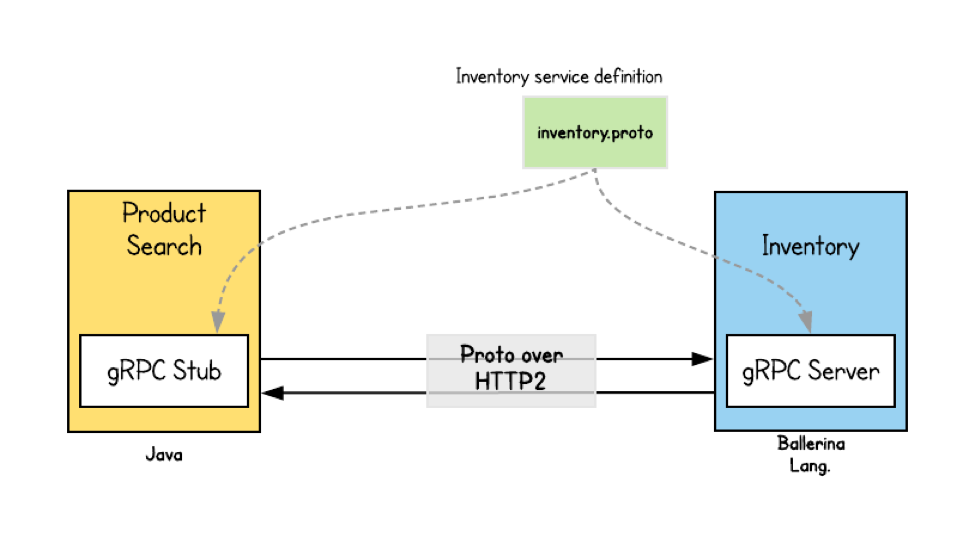

# Описание endpoint'ов 
## Микросервис авторизации

POST /auth/reg - Регистрация пользователя
Принимает данные пользователя в теле запроса (в формате JSON)
Создает нового пользователя в базе данных
При успешной регистрации возвращает JWT токен

Возможные коды ответа:
 - 400 - неверный формат запроса
 - 500 - ошибка при создании пользователя или генерации токена
 - 200 - успешная регистрация (возвращает токен)

GET /auth/login - Вход пользователя
Принимает учетные данные (email и пароль) в теле запроса
Проверяет их в базе данных
При успешной аутентификации возвращает JWT токен

Возможные коды ответа:
 - 401 - неверные учетные данные или ошибка запроса
 - 500 - ошибка генерации токена
 - 200 - успешный вход (возвращает токен)

GET /users/
Получение списка всех пользователей

Возможные коды ответа:
 - 200 OK + массив пользователей (успех)
 - 500 Internal Server Error (ошибка сервера)

POST /users/
Создание нового пользователя
Принимает JSON с данными пользователя (UserData)

Возможные коды ответа:
 - 200 OK + ID и email созданного пользователя
 - 400 Bad Request (неверный формат данных)
 - 500 Internal Server Error (ошибка при создании)

GET /users/:id
Получение пользователя по ID
Параметр :id в URL (число)

Возможные коды ответа:
 - 200 OK + ID и email пользователя
 - 400 Bad Request (неверный ID)
 - 500 Internal Server Error (ошибка сервера)

PUT /users/
Обновление данных пользователя
Принимает JSON с обновленными данными (UserData)

Возможные коды ответа:
 - 200 OK + обновленные данные пользователя
 - 400 Bad Request (неверный формат данных)
 - 500 Internal Server Error (ошибка сервера)

DELETE /users/:id
Удаление пользователя по ID
Параметр :id в URL (число)

Возможные коды ответа:
 - 200 OK (успешное удаление)
 - 400 Bad Request (неверный ID)
 - 500 Internal Server Error (ошибка сервера)




Также в рамках проекта используется технология gRPC.
gRPC — это высокопроизводительный фреймворк для удалённого вызова процедур (RPC), разработанный Google и использующий HTTP/2 и Protocol Buffers (Protobuf) для эффективной связи между сервисами. В отличие от традиционных REST/JSON API, gRPC работает с бинарным форматом данных, что делает его значительно быстрее и компактнее. Он поддерживает несколько режимов взаимодействия: обычные запросы-ответы (Unary), одностороннюю потоковую передачу данных (Server Streaming и Client Streaming), а также двусторонний поток (Bidirectional Streaming), что делает его идеальным для чатов, IoT и систем реального времени. Одним из ключевых преимуществ gRPC является автоматическая генерация клиентского и серверного кода на основе .proto-файлов, что обеспечивает кросс-языковую совместимость (Go, Python, Java, C# и другие). 

В данном случае местом, откуда вызывается процедура - микросервис авторизации, а где вызывается - микросервис простов. Для возможности вызова функций используется протобафф, который генерируется автоматически

Код запуска параллельного потока с gRPC:
```
func InitGRPC() {

	lis, err := net.Listen("tcp", ":50051")
	if err != nil {
		log.Fatalf("failed to listen: %v", err)
	}
	s := grpc.NewServer()
	RegisterUserServiceServer(s, &server{})

	go func() {
		log.Println("gRPC server running on :50051")
		if err := s.Serve(lis); err != nil {
			log.Fatalf("failed to serve: %v", err)
		}
	}()
}

func (s *server) GetUser(ctx context.Context, req *UserRequest) (*UserResponse, error) {
	
	return &UserResponse{
		Id:    req.UserId,
		Email: "john@example.com",
	}, nil
}
```

## Микросервис постов

POST /posts
 - Создание поста с загрузкой изображения (multipart/form-data)
 - Принимает CreatePost (DTO) + файл image
 - Присутствует загрузка файлов, данные получаются в бинарном формате и восстанавливаются в виде фото
 - Логирует данные, вызывает функцию создания (ORM - Sequalize)

GET /posts
 - Получение всех постов
 - Возвращает результат получения данных (ORM - Sequalize)

DELETE /posts/:id
 - Удаление поста по id (из URL-параметра)
 - Вызывает функцию удаления (ORM - Sequalize))

PUT /posts/:id
 - Обновление поста по id с возможной заменой изображения
 - Принимает CreatePost (DTO) + опциональный файл image
 - Вызывает функцию обновления (ORM - Sequalize)

Для запуска запроса по потоку gRPC так же генерируется протобафф файл, а также был написан следующий код:
```
interface GrpcClientService {
  GetUser(data: { user_id: string }): Observable<any>;
}

@Injectable()
export class UserService {
  private grpcClientService: GrpcClientService;

  constructor(@Inject('USER_PACKAGE') private client: ClientGrpc) {}

  onModuleInit() {
    this.grpcClientService =
      this.client.getService<GrpcClientService>('UserService');
  }

  getUser(userId: string) {
    return this.grpcClientService.GetUser({ user_id: userId });
  }
}
```
