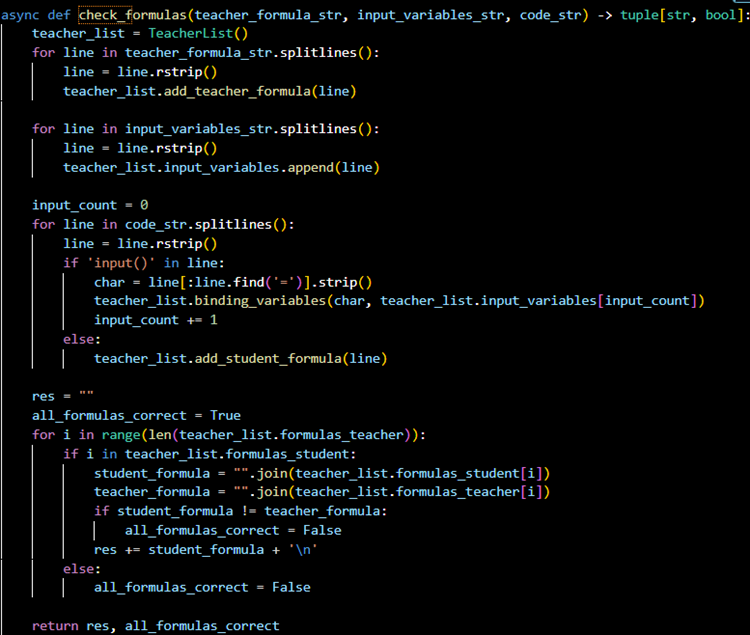
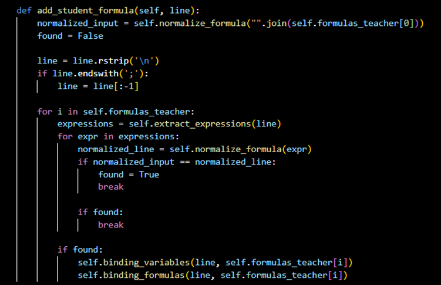
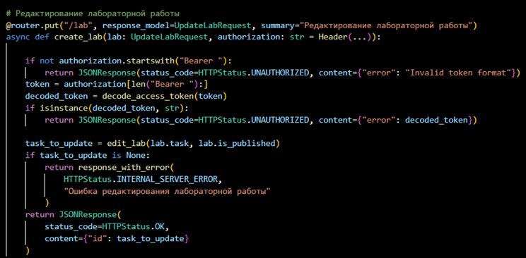
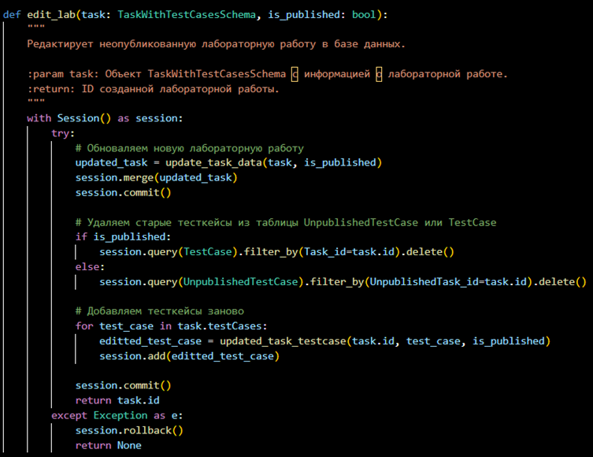

Проект представляет собой веб-приложение, состоящее из клиентской части, написанной на React.js и серверной части, написанной на FastAPI с использованием в качестве СУБД Postgres. 
В рамках проекта было реализовано много функционала:
1.	Логика проверка формул
В рамках проекта реализован функционал поиска и проверки правильности формулы (рис. 1-2).

Рис. 1 – Первая часть логики проверки формул

Рис. 2 – Вторая часть логики проверки формул
2.	Возможность учителем редактировать работы
Учителя могут создавать лабораторные работы для студентов, которые те могут выполнять (рис. 3-4).

Рис. 3 – Первая часть функционала редактора

Рис. 4 – Вторая часть функционала редактора
Также в рамках проекта, поскольку он достаточно долго длится (3 года), было проведено много рефакторинга и чистики кода, который был написан прошлыми студентами.
Также была проведена нормализация базы данных для адекватной работы Backend’а.
